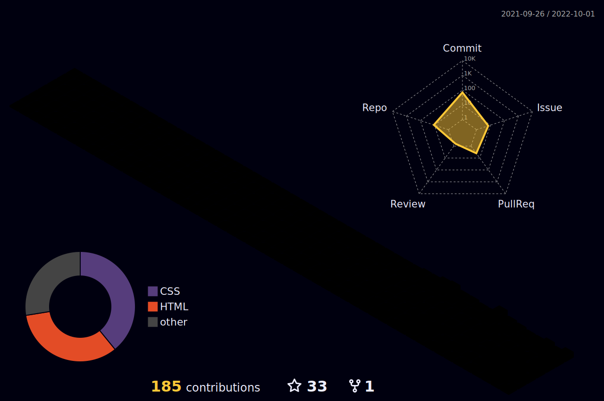

### Hi there  👋 Kundan Wakudkar

Here are some ideas to get you started:

- 🔭 I’m currently working on Spring Boot
- 🌱 I’m currently learning Java backend Development

- 📫 How to reach me: https://kundan-10.github.io/

<h3 align="left">Connect with me:</h3>

<h2 align="center">Languages and Tools:</h2>
   
  

      
      
      
      
      
      

  
<h2 align="center">📊 My Github Stats<h2>

  
  

   
  

  
  

  
 

  

  

	

<!-- 

 -->
	

   

